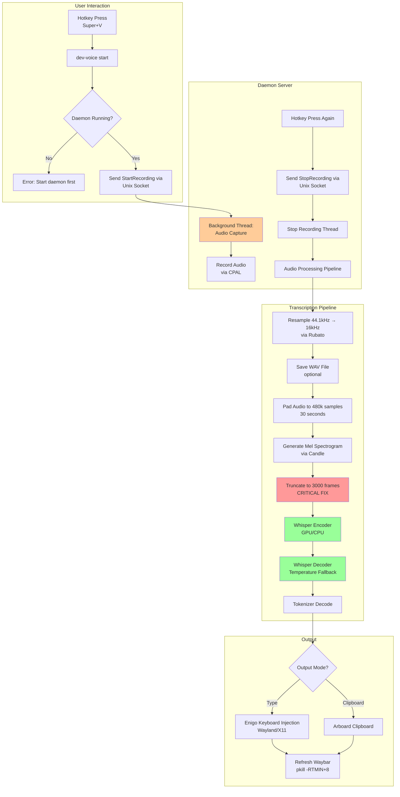
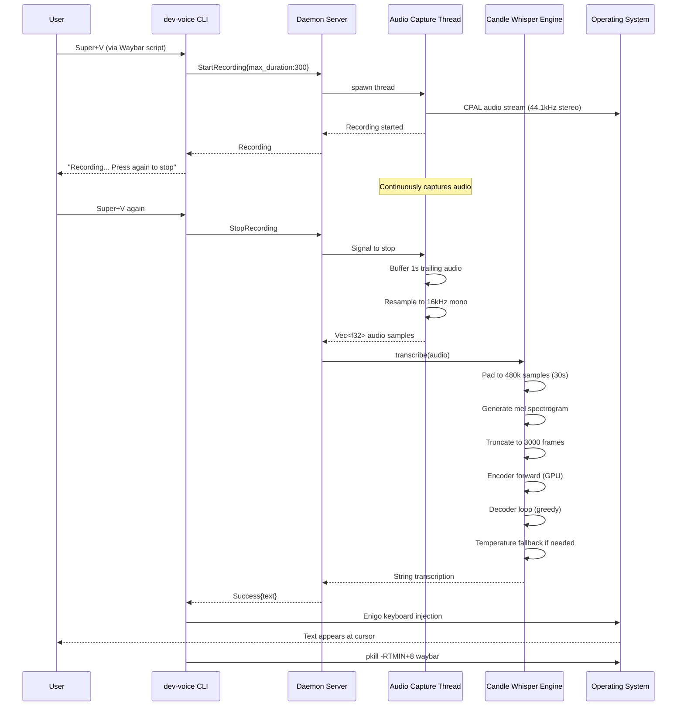

# dev-voice: Current Implementation State

**Status:** Active Development (v0.1.0)
**Branch:** `impl/v2-candle`
**Last Updated:** December 28, 2025

---

## 🎯 What is dev-voice?

A local, GPU-accelerated voice dictation tool for Linux developers. Press a hotkey, speak naturally, and text appears at your cursor. Built with Rust, powered by OpenAI Whisper via the Candle ML framework.

---

## 🏗️ System Architecture



---

## 🔄 Data Flow: Start → Transcription → Output



---

## 📦 Available Models

### Currently Supported (GGUF Format via Candle)

| Model | Size | Speed | Accuracy | Use Case |
|-------|------|-------|----------|----------|
| **tiny.en** | 78 MB | Very Fast | ~80% | Testing, fast feedback |
| **base.en** | 148 MB | Fast | ~85% | Quick transcription |
| **small.en** | 488 MB | Medium | ~90% | Balanced performance |
| **medium.en** | 1.5 GB | Slow | ~95% | High accuracy needed |
| **large-v3** | 3.1 GB | Very Slow | ~98% | Maximum accuracy |
| **large-v3-turbo** | 1.6 GB | Fast | ~98% | **RECOMMENDED** (809M params) |
| **distil-large-v3** | 1.5 GB | Fast | ~96% | Distilled version |

### Current Default Configuration

```toml
[model]
path = "~/.local/share/applications/dev-voice/models/whisper-large-v3-turbo-safetensors"
model_id = "openai/whisper-large-v3-turbo"
language = "en"
prompt = null  # Disabled - causes decoder buffer overflow
draft_model_path = "~/.local/share/applications/dev-voice/models/ggml-tiny.en.bin"  # Not implemented
```

**Active Model:** Whisper Large V3 Turbo (safetensors format)
- **Architecture:** 32 encoder layers, 4 decoder layers
- **Parameters:** 809M (smaller than Large V3's 1.5B)
- **Max Source Positions:** 1500 (encoder output frames)
- **Max Target Positions:** 448 (decoder token limit)
- **Model Dimension:** 1280

---

## ✅ Fully Implemented Features

### 🎤 Audio Capture
- **Library:** CPAL (cross-platform audio)
- **Input:** Stereo 44.1kHz (standard PipeWire output)
- **Processing:** Automatic resampling to mono 16kHz via Rubato
- **Toggle Mode:** Start recording → Stop recording workflow
- **Fixed Duration:** Record for N seconds
- **Trailing Buffer:** 1-second buffer after stop signal for natural cutoff

### 🧠 Transcription Engine
- **Framework:** Candle (Rust ML framework by HuggingFace)
- **GPU Support:** CUDA (NVIDIA), Metal (Apple Silicon)
- **Model Format:** Safetensors (normal) and GGUF (quantized)
- **Temperature Fallback:** [0.0, 0.2, 0.4, 0.6, 0.8, 1.0]
- **Quality Metrics:** Compression ratio, average log probability
- **Token Suppression:** Blank tokens + timestamps suppressed
- **EOT Detection:** Properly stops at end-of-transcription token

#### Critical Fixes Applied
1. **Mel Spectrogram Truncation** (Dec 28, 2025)
   - **Problem:** Candle's `pcm_to_mel` generates 4500 frames for 480k samples
   - **Expected:** 3000 frames (to match encoder's max 1500 positions after 2x downsampling)
   - **Solution:** Truncate mel to 3000 frames after generation
   - **Impact:** Fixes "narrow invalid args" tensor dimension errors

### 🖥️ Daemon Architecture
- **Protocol:** Unix domain sockets (JSON messages)
- **Location:** `~/.local/state/dev-voice/daemon.sock`
- **Model Loading:** Loads model once into GPU VRAM, stays resident
- **Threading:** Background thread for audio capture during recording
- **State Management:** PID file tracking for active recordings

#### Daemon Requests
- `Ping` - Health check
- `StartRecording{max_duration}` - Begin capture
- `StopRecording` - End capture and transcribe

#### Daemon Responses
- `Pong` - Alive
- `Recording` - Started successfully
- `Success{text}` - Transcription complete
- `Error{message}` - Failure

### ⌨️ Text Output
- **Keyboard Injection:** Enigo library
  - Wayland: Native wayland-client protocol
  - X11: xdotool-equivalent
  - macOS: CoreGraphics
  - Windows: SendInput API
- **Clipboard:** Arboard library (cross-platform)
- **UI Refresh:** Waybar signal (`pkill -RTMIN+8 waybar`)

### 💾 Configuration System
- **Format:** TOML
- **Location:** `~/.config/dev-voice/config.toml`
- **Validation:** `dev-voice config --check`
- **Migration:** `dev-voice config --migrate` (creates timestamped backups)
- **Reset:** `dev-voice config --reset`

### 📥 Model Download
- **Registry:** Hardcoded SHA256 checksums for verification
- **Source:** HuggingFace model repositories
- **Verification:** SHA256 hash validation after download
- **Progress:** File size progress indicators

### 📝 Logging
- **Console:** Stdout with timestamps
- **File:** `~/.local/state/dev-voice/logs/dev-voice.log` (daily rotation)
- **Levels:** INFO (default), DEBUG (with --verbose)
- **Filter:** Respects `RUST_LOG` environment variable

---

## 🚧 Half-Implemented Features

### 🔮 Speculative Decoding
- **Status:** Config field exists, not implemented
- **Config:** `model.draft_model_path = "ggml-tiny.en.bin"`
- **Goal:** Use tiny model for fast token prediction, verify with main model
- **Benefit:** 2-3x speedup for long-form transcription
- **Blocker:** Candle Whisper doesn't expose draft model API

### 📝 Initial Prompt Biasing
- **Status:** Disabled by default (causes decoder issues)
- **Config:** `model.prompt = null`
- **Goal:** Bias transcription toward technical vocabulary
- **Problem:** Long prompts (>50 tokens) cause decoder buffer overflow
- **Current Workaround:** Prompt disabled, relies on model's training data

---

## ❌ Not Implemented (But Planned)

### 🤖 LLM Post-Processing
- **Vision:** Context-aware text correction
  - Raw: "create a function called get user by eye dee"
  - Corrected: "getUserById"
- **Options:**
  - Local: Ollama (Llama 3.2, Qwen2.5)
  - Cloud: Claude API, OpenAI
- **Blocker:** Not started, post-MVP feature

### 🎙️ Voice Activity Detection (VAD)
- **Vision:** Auto-start/stop recording based on speech detection
- **Benefits:** More natural workflow, no manual stop needed
- **Blocker:** CPAL doesn't provide VAD, would need additional library

### 🔊 Voice Commands
- **Vision:** Special commands like "new line", "select all", "undo"
- **Implementation:** Pattern matching in transcribed text
- **Blocker:** No command parser implemented

### ⌨️ Global Hotkey Listener
- **Vision:** Built-in hotkey registration (no external dependency)
- **Current:** Relies on Waybar/sxhkd/external hotkey daemon
- **Blocker:** Cross-platform hotkey library needed (e.g., `global-hotkey`)

### 🖼️ Tray Icon / Status Indicator
- **Vision:** System tray with recording indicator
- **Current:** Waybar module shows status
- **Blocker:** Cross-platform tray library (egui-notify, gtk-rs)

### 🪟 Active Window Context
- **Vision:** Detect active window/IDE, adjust post-processing
- **Example:** In VS Code → camelCase, in terminal → kebab-case
- **Blocker:** Window manager integration needed

---

## 🐛 Known Issues & Limitations

### 1. Mel Spectrogram Frame Count Mismatch
- **Issue:** Candle's `pcm_to_mel` generates 4500 frames instead of 3000
- **Cause:** Unknown (possibly hop_length ≈ 107 vs expected 160)
- **Workaround:** Truncate to 3000 frames (see commit `fad4c5a`)
- **Impact:** Works correctly, but wastes ~33% of mel computation

### 2. Prompt Biasing Disabled
- **Issue:** Initial prompts cause decoder token overflow
- **Cause:** Max prompt tokens should be <50, but technical vocabulary needs more
- **Workaround:** Disabled by default (`prompt = null`)
- **Impact:** Less accurate for technical terms (async, enum, impl, etc.)

### 3. CPU-Only Build by Default
- **Issue:** `cargo build --release` produces CPU-only binary
- **Solution:** Must explicitly enable CUDA: `cargo build --release --features cuda`
- **Impact:** 18 seconds CPU vs <1 second GPU for short clips

### 4. No Built-in Hotkey Support
- **Issue:** User must configure external hotkey daemon
- **Current Setup:** Waybar script + hyprland keybind
- **Impact:** Not plug-and-play, requires manual configuration

### 5. Large Model Size
- **Issue:** Whisper Large V3 Turbo is 1.6GB
- **Solution:** Users can download smaller models (base.en = 148MB)
- **Impact:** Initial download time, disk space usage

---

## 🔧 Technical Stack

### Dependencies

| Category | Library | Purpose | Notes |
|----------|---------|---------|-------|
| **ML Framework** | candle-core | Tensor operations | GPU support via CUDA/Metal |
| **ML Models** | candle-transformers | Whisper model | Encoder-decoder architecture |
| **Audio** | cpal | Audio capture | Cross-platform (PipeWire/ALSA/CoreAudio) |
| **Resampling** | rubato | 44.1kHz → 16kHz | High-quality sinc interpolation |
| **Keyboard** | enigo | Text injection | Wayland/X11/macOS/Windows |
| **Clipboard** | arboard | Copy to clipboard | Cross-platform |
| **Tokenizer** | tokenizers | Whisper tokenizer | HuggingFace tokenizers |
| **Model Hub** | hf-hub | Model downloads | HuggingFace Hub API |
| **Serialization** | safetensors | Model weights | Memory-mapped loading |
| **Config** | confy | TOML config | Auto-create default config |
| **CLI** | clap | Command parsing | Derive macros |
| **Logging** | tracing | Structured logs | Console + file appender |

### Build Features

```toml
[features]
default = []
cuda = ["candle-core/cuda", "candle-nn/cuda", "candle-transformers/cuda"]
metal = ["candle-core/metal", "candle-nn/metal", "candle-transformers/metal"]
```

**Platform-Specific:**
- **Linux:** `enigo` with `wayland` or `x11rb` features
- **macOS:** `enigo` with CoreGraphics
- **Windows:** `enigo` with SendInput
- **Unix:** `nix` crate for signal handling (toggle mode)

---

## 📂 Project Structure

```
dev-voice/
├── src/
│   ├── main.rs                  # CLI entry point, command routing
│   ├── audio/mod.rs             # CPAL audio capture, resampling
│   ├── daemon/
│   │   ├── server.rs            # Unix socket server, threading
│   │   ├── client.rs            # Socket client helpers
│   │   └── protocol.rs          # JSON request/response types
│   ├── transcribe/
│   │   ├── mod.rs               # Transcriber trait
│   │   ├── candle_engine.rs     # Candle Whisper implementation ⚡
│   │   └── whisper.rs           # Legacy whisper-rs (unused)
│   ├── output/mod.rs            # Enigo keyboard, arboard clipboard
│   ├── config/
│   │   ├── mod.rs               # Config load/save/validate
│   │   └── settings.rs          # Config structs, defaults
│   ├── model/
│   │   ├── registry.rs          # Model SHA256 checksums
│   │   ├── download.rs          # HTTP download, verification
│   │   └── verify.rs            # SHA256 validation
│   └── state/
│       ├── paths.rs             # XDG directories
│       └── toggle.rs            # PID file management
├── assets/
│   ├── melfilters80.bytes       # 80-bin mel filterbank
│   └── melfilters128.bytes      # 128-bin mel filterbank
├── docs/
│   └── context/
│       ├── voice-dictation-tool.md        # Original planning doc
│       └── current-implementation-state.md # This document
└── Cargo.toml                    # Dependencies, features
```

---

## 🎯 Development Workflow

### Building

```bash
# CPU-only (default)
cargo build --release

# GPU-accelerated (NVIDIA)
cargo build --release --features cuda

# GPU-accelerated (Apple Silicon)
cargo build --release --features metal
```

### Running Daemon

```bash
# Option 1: Use wrapper script (sets LD_LIBRARY_PATH for CUDA)
dev-voice-gpu daemon &

# Option 2: Direct binary
./target/release/dev-voice daemon &

# Check daemon is running
./target/release/dev-voice start
```

### Testing Transcription

```bash
# Toggle mode (recommended)
./target/release/dev-voice start   # Start recording
# Speak: "Testing one two three"
./target/release/dev-voice start   # Stop and transcribe

# Fixed duration (5 seconds)
./target/release/dev-voice start --duration 5

# Clipboard mode
./target/release/dev-voice start --clipboard
```

### Debugging

```bash
# Enable verbose logging
./target/release/dev-voice --verbose daemon

# Check logs
tail -f ~/.local/state/dev-voice/logs/dev-voice.log

# Test keyboard injection
./target/release/dev-voice enigo-test --text "Hello World"
```

---

## 🚀 Performance Characteristics

### Transcription Speed (6-second audio clip)

| Configuration | Time | Notes |
|--------------|------|-------|
| **CPU (16 threads)** | ~18s | AMD Ryzen / Intel Core |
| **CUDA (RTX 4090)** | <1s | 24GB VRAM, batch size 1 |
| **Metal (M1 Max)** | ~2s | 32GB unified memory |

### Model Loading Time

| Model | CPU | GPU (CUDA) | VRAM Usage |
|-------|-----|-----------|-----------|
| tiny.en | ~500ms | ~200ms | ~300MB |
| base.en | ~1s | ~300ms | ~600MB |
| large-v3-turbo | ~3s | ~1s | ~3.2GB |

### Daemon Memory Usage

- **Idle:** ~3.5GB (model loaded in VRAM)
- **Recording:** +50MB (audio buffer)
- **Transcribing:** +200MB (temporary tensors)

---

## 🔮 Roadmap

### Short-Term (Next Release)
- [ ] Fix mel spectrogram generation (upstream Candle issue)
- [ ] Re-enable prompt biasing with token limit
- [ ] Add built-in hotkey listener (remove Waybar dependency)
- [ ] Package for Linux (AppImage, Flatpak)

### Medium-Term (v0.2.0)
- [ ] Implement speculative decoding (2-3x speedup)
- [ ] Add VAD for auto-stop
- [ ] Voice commands ("new line", "undo")
- [ ] Active window context detection
- [ ] GUI settings app

### Long-Term (v1.0.0)
- [ ] LLM post-processing (local Ollama integration)
- [ ] Custom vocabulary/corrections
- [ ] Multi-language support
- [ ] Plugin system for IDE integrations
- [ ] Mobile app (Android voice relay)

---

## 📊 Architecture Decisions

### Why Candle over whisper-rs?
- **GPU Support:** First-class CUDA/Metal support
- **Model Format:** Safetensors (modern, memory-mapped)
- **Flexibility:** Access to encoder/decoder internals
- **Maintenance:** Active development by HuggingFace
- **Tradeoff:** Larger binary size (~50MB vs ~5MB)

### Why Daemon Architecture?
- **Model Loading:** 3-second startup cost paid once
- **GPU VRAM:** Keep model resident (avoid reload)
- **Responsiveness:** Sub-second transcription after daemon start
- **Tradeoff:** Memory usage (3.5GB always running)

### Why Unix Sockets over IPC?
- **Simplicity:** JSON over newline-delimited sockets
- **Security:** File permissions control access
- **Portability:** Works on all Unix-like systems
- **Tradeoff:** Not available on Windows (would need named pipes)

### Why Enigo over wtype/xdotool?
- **Cross-platform:** Works on Linux, macOS, Windows
- **No External Deps:** Pure Rust, no subprocess calls
- **Maintenance:** Active library with Wayland support
- **Tradeoff:** Larger dependency tree

---

## 🔬 Debugging Tips

### "narrow invalid args" Error
**Symptom:** Transcription fails with tensor dimension error
**Cause:** Mel spectrogram has >3000 frames
**Fix:** Ensure truncation is enabled (commit `fad4c5a`)

### "CUDA initialization failed"
**Symptom:** Falls back to CPU despite CUDA available
**Cause:** Binary not built with CUDA features
**Fix:** `cargo build --release --features cuda`

### "Daemon is not running"
**Symptom:** Client can't connect to daemon
**Cause:** Daemon not started or crashed
**Fix:**
1. Check socket exists: `ls ~/.local/state/dev-voice/daemon.sock`
2. Check daemon process: `pgrep -f "dev-voice daemon"`
3. Restart: `dev-voice-gpu daemon &`

### No Text Appears
**Symptom:** Transcription succeeds but no text injected
**Cause:** Enigo Wayland permissions or focus issues
**Fix:**
1. Test clipboard mode: `dev-voice start --clipboard`
2. Test enigo: `dev-voice enigo-test`
3. Check Waybar refresh: `pkill -RTMIN+8 waybar`

### Poor Transcription Quality
**Symptom:** Inaccurate or missing words
**Possible Causes:**
1. Model too small (try large-v3-turbo)
2. Audio quality (check microphone)
3. Background noise (use noise gate)
4. Language mismatch (check config.language)

---

## 📝 Recent Changes

### v0.1.0-alpha (December 2025)
- ✅ Migrated from whisper-rs to Candle framework
- ✅ Fixed mel spectrogram truncation bug
- ✅ Added config validation and migration
- ✅ Implemented daemon architecture
- ✅ Added CUDA and Metal GPU support
- ✅ Cross-platform keyboard injection
- ✅ Waybar status integration
- ✅ Audio clip saving (optional)

---

## 📚 References

- [Candle ML Framework](https://github.com/huggingface/candle)
- [OpenAI Whisper](https://github.com/openai/whisper)
- [Whisper.cpp](https://github.com/ggerganov/whisper.cpp)
- [CPAL Audio](https://github.com/RustAudio/cpal)
- [Enigo Keyboard](https://github.com/enigo-rs/enigo)
- [Rubato Resampling](https://github.com/HEnquist/rubato)
